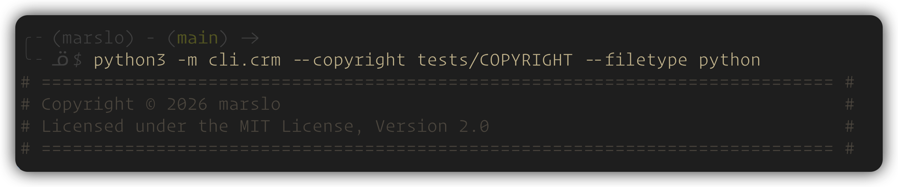
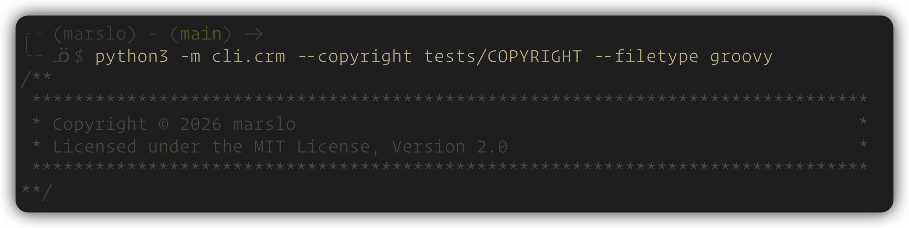
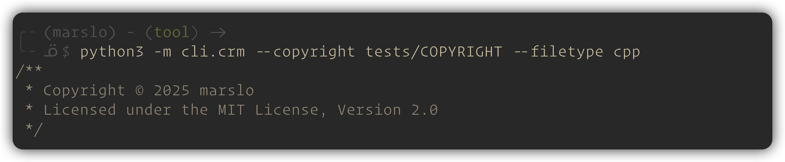

# copyright manager (crm.py)

A tool to automatically **add**, **update**, or **delete** multi-format copyright headers in source files.

---

## Features

- **Add**: Insert copyright headers for multiple file types.
- **Update**: Force update or insert headers if missing.
- **Check**: Verify the presence and correctness of headers.
- **Delete**: Remove detected copyright headers from files.
- Supports recursive directory traversal and filetype auto-detection or override.

---

## Supported File Types and Formats

|                    FILETYPE                   |           SUFFIXES          |
|:---------------------------------------------:|:---------------------------:|
| `python`, `shell`, `bash`, `sh`, `dockerfile` | `.py`, `.sh`, `.dockerfile` |

```
#===============================================================================
# Copyright © 2025 marslo                                                      #
# Licensed under the MIT License, Version 2.0                                  #
#===============================================================================
```



---

|                  FILETYPE                 |      SUFFIXES      |
|:-----------------------------------------:|:------------------:|
| `jenkinsfile`, `groovy`, `gradle`, `java` | `.groovy`, `.java` |

```
/**
 *******************************************************************************
 * Copyright © 2025 marslo                                                     *
 * Licensed under the MIT License, Version 2.0                                 *
 *******************************************************************************
**/
```



---

|                   FILETYPE                  |                  SUFFIXES                  |
|:-------------------------------------------:|:------------------------------------------:|
| `c`, `cpp`, `c++`, `cxx`, `h`, `hpp`, `hxx` | `.c`, `.cpp`, `.cxx`, `.h`, `.hpp`, `.hxx` |

```
/**
 * Copyright © 2025 marslo
 * Licensed under the MIT License, Version 2.0
 */
```



---

## Action Modes

> [!TIP]
> without any action mode specified, the default action is to **add** copyright headers.

| OPTION     | DESCRIPTION                                                                 |
| ---------- | --------------------------------------------------------------------------- |
| `--check`  | Check mode: Verifies file copyright status (match, mismatch, or not found). |
| `--delete` | Delete mode: Removes detected copyright headers from files.                 |
| `--update` | Update mode: Forces replacement of copyright or adds it if missing.         |

## Usage

### add new copyright headers
```bash
# single file
$ python crm.py /path/to/file

# files recursively in directories
$ python crm.py --recursive /path/to/directory

# add to non-supported suffixes with supplied filetype
# -- e.e. add to .txt files as python files --
$ python crm.py --filetype python /path/to/file.txt
```

### update existing copyright headers

> [!TIP]
> `--filetype <TYPE>` can be used to force a specific filetype for the update action, overriding auto-detection.

```bash
# single file
$ python crm.py --update /path/to/file

# files recursively in directories
$ python crm.py --update --recursive /path/to/directory
```

### delete existing copyright headers

> [!TIP]
> `--filetype <TYPE>` can be used to force a specific filetype for the update action, overriding auto-detection.

```bash
# single file
$ python crm.py --delete /path/to/file

# files recursively in directories
$ python crm.py --delete --recursive /path/to/directory
```

### debug mode
```bash
# *add* without modifying files
$ python crm.py --debug /path/to/file

$ *update* without modifying files
$ python crm.py --update --debug /path/to/file

# *delete* without modifying files
$ python crm.py --delete --debug /path/to/file
```

### check specific filetype
```bash
$ python crm.py --filetype python
$ python crm.py --filetype java
$ python crm.py --filetype cpp
```

### help message
```bash
$ python -m cli.crm --help
USAGE
  python -m cli.crm [--check | --delete | --update] [--copyright FILE] [--filetype TYPE] [--recursive]
                    [--debug] [--verbose] [--help] [--version]
                    [FILES ...]

A tool to automatically add, update, or delete multi-format copyright headers.

POSITIONAL ARGUMENTS:
  [FILES ...]               List of target files or directories to process.

ACTION MODES (default is add):
  --check                   Check mode: Verifies file copyright status (match, mismatch, or not found).
  --delete                  Delete mode: Removes detected copyright headers from files.
  --update                  Update mode: Forces replacement of copyright or adds it if missing.

OPTIONS:
  --copyright FILE          Specify the copyright template file path (default: COPYRIGHT).
  --filetype -t TYPE        Force a filetype to override auto-detection (e.g., 'python', 'java'). If
                            provided alone, displays a formatted preview for that type.
  --recursive -r            If FILES includes directories, process their contents recursively.
  --debug -d                Debug mode: Preview the result of an action without modifying files.
  --verbose -v              Show a detailed processing summary.
  --help -h                 Show this help message and exit.
  --version                 Show program's version number and exit.
```
