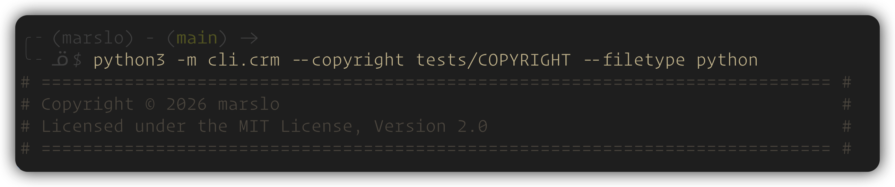
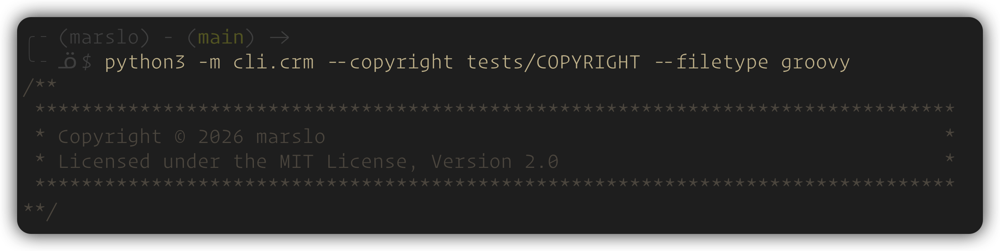
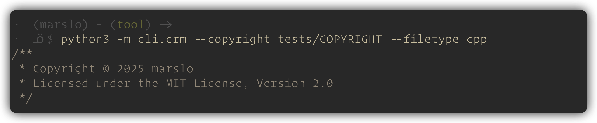
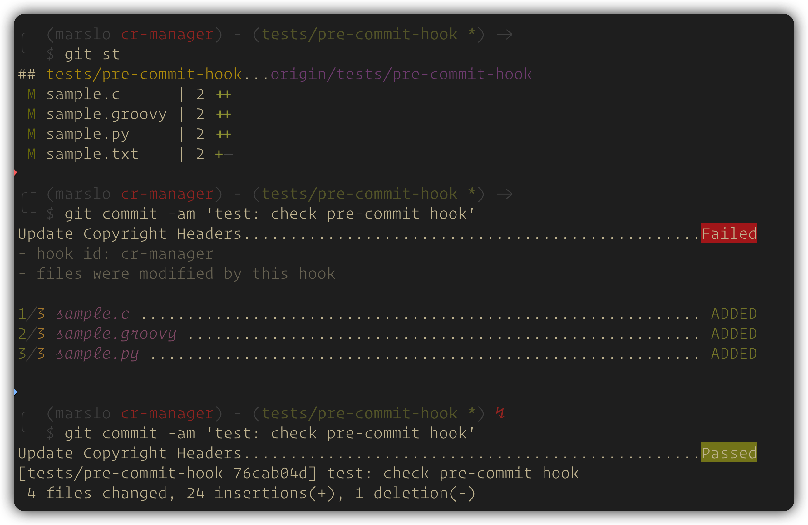
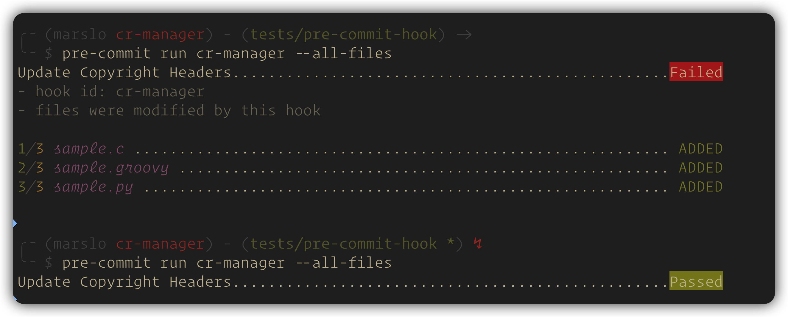
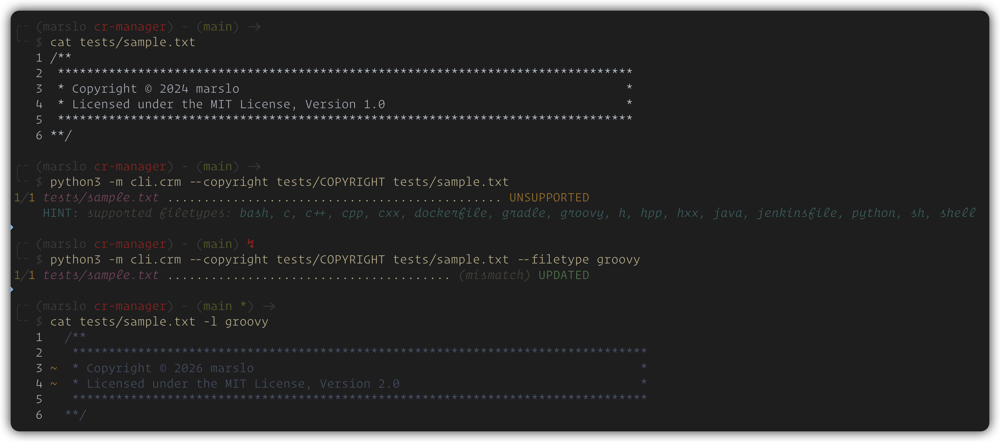

# cr-manager -- the Copyright Header Manager

A tool to automatically **add**, **update**, or **delete** multi-format copyright headers in source files.

---

[](https://github.com/marslo/cr-manager/releases/latest)
[](https://github.com/marslo/cr-manager/releases/latest)

[](https://pypi.org/project/cr-manager/)
[](https://pypi.org/project/cr-manager/)
[](https://github.com/marslo/cr-manager/releases/latest)
[](https://github.com/marslo/cr-manager/releases/latest)
[](https://github.com/marslo/cr-manager/releases/latest)


---

- [Features](#features)
- [How to Contribute](#how-to-contribute)
- [How to Install](#how-to-install)
  - [Install as Binary](#install-as-binary)
    - [Install bash_completion](#install-bash_completion)
  - [Install as pre-commit Hook](#install-as-pre-commit-hook)
  - [Install as Local Package](#install-as-local-package)
- [Action Modes](#action-modes)
  - [Supported File Types and Formats](#supported-file-types-and-formats)
- [Running as pre-commit Hooks](#running-as-pre-commit-hooks)
  - [Running Manually](#running-manually)
  - [Running Automatically](#running-automatically)
  - [Running for Unsupported Filetype](#running-for-unsupported-filetype)
- [Running as Binary](#running-as-binary)
  - [Add New Copyright Headers](#add-new-copyright-headers)
  - [Update Existing Copyright Headers](#update-existing-copyright-headers)
  - [Delete Existing Copyright Headers](#delete-existing-copyright-headers)
  - [Debug Mode](#debug-mode)
- [Format Configuration](#format-configuration)
  - [Config Fields](#config-fields)
  - [Format Modes](#format-modes)
  - [Modifying an Existing Format](#modifying-an-existing-format)
  - [Adding a New Format](#adding-a-new-format)
- [Help Message](#help-message)

---

# Features

- **Add**: Insert copyright headers for multiple file types.
- **Update**: Force update or insert headers if missing.
- **Check**: Verify the presence and correctness of headers.
- **Delete**: Remove detected copyright headers from files.
- Supports recursive directory traversal and filetype auto-detection or override.
- Supports combined author-info and copyright headers.

---

# [How to Contribute](./CONTRIBUTING.md)

---

# How to Install

> [!TIP]
> - enable the ansicolor in Windows terminal for better output experience.
>   ```batch
>   reg add HKCU\Console /v VirtualTerminalLevel /t REG_DWORD /d 1
>   ```

## Install as Binary

- pipx - [how to install pipx](https://pipx.pypa.io/stable/how-to/install-pipx/)

  <details>
  <summary><b>how to install pipx ...</b></summary>

  ```bash
  $ python3 -m pip install pipx
  $ python3 -m pipx ensurepath
  ```
  </details>

  ```bash
  # install from source
  $ pipx install --force "git+https://github.com/marslo/cr-manager"
  # upgrade
  $ pipx upgrade cr-manager
  # switch python version
  $ pipx reinstall cr-manager --python /path/to/python3.x
  ```

- pip
  ```bash
  # install from pypi
  $ python3 -m pip install --user cr-manager
  # upgrade
  $ python3 -m pip install --user --upgrade cr-manager
  ```

- linux/macos binary
  <details>
  <summary><b>Click to expand ...</b></summary>

  ```bash
  $ VERSION="$(curl -fsSL https://api.github.com/repos/marslo/cr-manager/releases/latest | jq -r .tag_name)"

  # linux
  $ curl -fsSL -o cr-manager https://github.com/marslo/cr-manager/releases/download/${VERSION}/cr-manager-linux
  $ chmod +x cr-manager

  # macos
  $ curl -fsSL -o cr-manager https://github.com/marslo/cr-manager/releases/download/${VERSION}/cr-manager-macos
  $ chmod +x cr-manager
  ```
  </details>

- windows binary

  <details>
  <summary><b>Click to expand ...</b></summary>

  ```bash
  > powershell -NoProfile -Command "$v=(Invoke-WebRequest -Uri 'https://api.github.com/repos/marslo/cr-manager/releases/latest' -UseBasicParsing | ConvertFrom-Json).tag_name; Invoke-WebRequest -Uri ('https://github.com/marslo/cr-manager/releases/download/'+$v+'/cr-manager.exe') -OutFile 'cr-manager.exe'; Write-Host ('Downloaded '+$v)"
  ```
  </details>


### Install bash_completion

> [!TIP]
> automatically detect the OS and install bash completion to the appropriate directory:
> - macos: `$(brew --prefix)/etc/bash_completion.d` → `$XDG_DATA_HOME/.local/share` →  `~/.bash_completion.d`
> - linux: `$XDG_DATA_HOME/.local/share` → `~/.bash_completion.d` → `/usr/share/bash-completion/completions` → `/etc/bash_completion.d`

```bash
# macos
$ cr-manager --install-completion
# or install manually
$ cr-manager --completion | tee "$(brew --prefix)/etc/bash_completion.d/cr-manager"
```

```bash
# linux user folder
$ cr-manager --install-completion
# or install manually
$ cr-manager --completion | tee ~/.bash_completion.d/cr-manager

# linux system folder (requires sudo)
$ sudo cr-manager --install-completion
# or install manually
$ cr-manager --completion | sudo tee /etc/bash_completion.d/cr-manager
```

```bash
# uninstall
test -f ~/.bash_completion.d/cr-manager && rm -rf ~/.bash_completion.d/cr-manager
test -f /etc/bash_completion.d/cr-manager && sudo rm -rf /etc/bash_completion.d/cr-manager
[[ 'Darwin' = "$(uname -s)" ]] && test -f "$(brew --prefix)/etc/bash_completion.d/cr-manager" && rm -rf "$(brew --prefix)/etc/bash_completion.d/cr-manager"
```

## Install as pre-commit Hook

```yaml
# specify the `COPYRIGHT` file to use, and only check specific files/folders
---
repos:
  - repo: https://github.com/marslo/cr-manager
    rev: v3.3.3
    hooks:
      - id: cr-manager
        args: ["--update", "--copyright", "path/to/COPYRIGHT"]
        files: ^(jenkinsfile/|.*\.(groovy|py|sh)$)
```

<details>
<summary>if <code>COPYRIGHT</code> file can be found in the root directory of this repository</summary>

```yaml
# if `COPYRIGHT` file can be found in the root directory of this repository
---
repos:
  - repo: https://github.com/marslo/cr-manager
    rev: v3.3.3
    hooks:
      - id: cr-manager
        args: ["--update"]
```
</details>


<details>
<summary>only check the copyright headers without modifying files after commit - <b>post-commit</b> check</summary>

```yaml
# only check the copyright headers without modifying files after commit
---
repos:
  - repo: https://github.com/marslo/cr-manager
    rev: v3.3.3
    hooks:
      - id: cr-manager
        args: ["--check"]
        stages: [post-commit]
```
</details>

## Install as Local Package

<details>
<summary><b>install from local source repo ...</b></summary>

```bash
# clone the repo
$ git clone git@github.com:marslo/cr-manager.git

# install via pip
# - in global --
$ python3 -m pip install --upgrade --editable .
# - in local --
$ python3 -m pip install --upgrade --user --editable .

# or install via pipx
$ pipx install --editable [--force] .
```
</details>

---

# Action Modes

> [!TIP]
> without any action mode specified, the default action is to **add** copyright headers.

| OPTION     | DESCRIPTION                                                                 |
| ---------- | --------------------------------------------------------------------------- |
|            | Add mode: Automatically adds copyright headers to files (default).          |
| `--add`    | Add mode: Automatically adds copyright headers to files (default).          |
| `--check`  | Check mode: Verifies file copyright status (match, mismatch, or not found). |
| `--delete` | Delete mode: Removes detected copyright headers from files.                 |
| `--update` | Update mode: Forces replacement of copyright or adds it if missing.         |

---

## Supported File Types and Formats

> [!TIP]
> - check [Running as CLI tool](#running-as-cli-tool) first to install necessary dependencies via `poetry install`.

|                    FILETYPE                   |           SUFFIXES          |
|:---------------------------------------------:|:---------------------------:|
| `python`, `shell`, `bash`, `sh`, `dockerfile` | `.py`, `.sh`, `.dockerfile` |

```bash
# without venv
$ poetry run cr-manager --filetype python

# with venv or install as binary
$ cr-manager --filetype python

# result
# ============================================================================ #
# Copyright © 2026 marslo                                                      #
# Licensed under the MIT License, Version 2.0                                  #
# ============================================================================ #
```



---

|                  FILETYPE                 |      SUFFIXES      |
|:-----------------------------------------:|:------------------:|
| `jenkinsfile`, `groovy`, `gradle`, `java` | `.groovy`, `.java` |

```
# without venv
$ poetry run cr-manager --filetype java

# with venv or install as binary
$ cr-manager --filetype groovy

# result
/**
 *******************************************************************************
 * Copyright © 2026 marslo                                                     *
 * Licensed under the MIT License, Version 2.0                                 *
 *******************************************************************************
**/
```



---

|                   FILETYPE                  |                  SUFFIXES                  |
|:-------------------------------------------:|:------------------------------------------:|
| `c`, `cpp`, `c++`, `cxx`, `h`, `hpp`, `hxx` | `.c`, `.cpp`, `.cxx`, `.h`, `.hpp`, `.hxx` |

```
# without venv
$ poetry run cr-manager --filetype c

# with venv or install as binary
$ cr-manager --filetype cpp

# result
/**
 * Copyright © 2026 marslo
 * Licensed under the MIT License, Version 2.0
 */
```



---

# Running as pre-commit Hooks

> [!TIP]
> - install the pre-commit hooks after adding the configuration to `.pre-commit-config.yaml` file:
>   ```bash
>   $ pre-commit install --install-hooks
>   ```



## Running Manually

> [!TIP]
> without hook, you can run the cr-manager manually for all files in the repository.

```bash
$ pre-commit run cr-manager --all-files

# or particular file
$ pre-commit run cr-manager --files path/to/file
```



## Running Automatically
```bash
$ git commit -m "your commit message"
```

## Running for Unsupported Filetype
```bash
$ cr-manager [--update] --filetype python /path/to/file.txt
```



---

# Running as Binary

## Add New Copyright Headers
```bash
# single file
$ cr-manager /path/to/file
# or
$ cr-manager --add /path/to/file

# files recursively in directories
$ cr-manager --recursive /path/to/directory
# or
$ cr-manager --add --recursive /path/to/directory

# add to non-supported suffixes with supplied filetype
# -- e.g. add to .txt files as python files --
$ cr-manager --filetype python /path/to/file.txt
# or
$ cr-manager --add --filetype python /path/to/file.txt
```

## Update Existing Copyright Headers

> [!TIP]
> `--filetype <TYPE>` can be used to force a specific filetype for the update action, overriding auto-detection.

```bash
# single file
$ cr-manager --update /path/to/file

# files recursively in directories
$ cr-manager --update --recursive /path/to/directory
```

## Delete Existing Copyright Headers

> [!TIP]
> `--filetype <TYPE>` can be used to force a specific filetype for the update action, overriding auto-detection.

```bash
# single file
$ cr-manager --delete /path/to/file

# files recursively in directories
$ cr-manger --delete --recursive /path/to/directory
```

## Debug Mode

```bash
# *add* without modifying files
$ cr-manager --debug /path/to/file
# or
$ cr-manager --add --debug /path/to/file

# *update* without modifying files
$ cr-manager --update --debug /path/to/file

# *delete* without modifying files
$ cr-manager --delete --debug /path/to/file
```

---

# Format Configuration

All comment-style definitions live in [`cli/libs/formats.toml`](./cli/libs/formats.toml) — **no hardcoded formats in the source code**. The engine loads this file at startup and builds every format automatically, so adding or tweaking a style never requires code changes.

## Config Fields

| FIELD           | DESCRIPTION                                                          |
| --------------- | -------------------------------------------------------------------- |
| `start_line`    | Opening wrapper line (e.g. `/**`). Empty for line-comment formats.   |
| `end_line`      | Closing wrapper line (e.g. `**/`). Empty for line-comment formats.   |
| `comment`       | Core comment marker for detection (e.g. `#`, `*`).                   |
| `content_left`  | Left delimiter of each content line (e.g. `# `, ` * `).              |
| `content_right` | Right delimiter of each content line (e.g. ` #`, ` *`, or empty).    |
| `box_left`      | Left side of the border line (`simple_format = false` only).         |
| `box_right`     | Right side of the border line (`simple_format = false` only).        |
| `box_char`      | Repeated character forming the border (e.g. `=`, `*`).               |
| `simple_format` | `true` → no border box; `false` → bordered with `box_char` framing.  |

## Format Modes

There are two rendering modes controlled by `simple_format`:

**Bordered** (`simple_format = false`) — content is framed between `box_char` border lines:

```
# ============================================================================ #   ← border
# Copyright © 2026 marslo                                                      #   ← content
# ============================================================================ #   ← border
```

**Simple** (`simple_format = true`) — content lines only, no border:

```
/**                           ← start_line
 * Copyright © 2026 marslo    ← content
 */                           ← end_line
```

## Modifying an Existing Format

Edit the corresponding `[name.config]` table in `formats.toml`. For example, to switch the Python/Shell format from `=` borders to `*` borders:

```toml
# change these two fields in [hash_comment.config]
box_char = "*"      # was "="
```

Then preview the result:

```bash
$ cr-manager --filetype python
```

## Adding a New Format

Append a new section to `formats.toml` — no code changes required:

```toml
[xml_comment]
filetypes = ["xml", "html", "xhtml"]
suffixes  = [".xml", ".html", ".xhtml"]

[xml_comment.config]
start_line    = "<!--"
end_line      = "-->"
comment       = ""
content_left  = "  "
content_right = ""
simple_format = true
```

Verify with:

```bash
$ cr-manager --filetype xml
# <!--
#   Copyright © 2026 marslo
#   Licensed under the MIT License, Version 2.0
# -->
```

The new format is immediately available for all action modes (`--add`, `--check`, `--update`, `--delete`).


# Help Message

```bash
$ cr-manager --help
USAGE:
  cr-manager [--add | --check | --delete | --update] [--copyright FILE] [--filetype TYPE] [--recursive]
             [--debug] [--verbose] [--completion] [--install-completion] [--help] [--version]
             FILES ...

A tool to automatically add, update, or delete multi-format copyright headers.

POSITIONAL ARGUMENTS:
  FILES ...                 List of target files or directories to process.

ACTION MODES:
  -a, --add                 Add mode: Adds copyright header to files that are missing it (default).
  -c, --check               Check mode: Verifies file copyright status (match, mismatch, or not found).
  -d, --delete              Delete mode: Removes detected copyright headers from files.
  -u, --update              Update mode: Forces replacement of copyright or adds it if missing.

OPTIONS:
  --copyright FILE          Specify the copyright template file path (default: COPYRIGHT).
  -t, --filetype TYPE       Force override a filetype instead of auto-detection.
                            If provided, displays a formatted preview for that type. Supported: bash, c,
                            c++, cpp, cxx, dockerfile, gradle, groovy, h, hpp, hxx, java, jenkinsfile,
                            python, sh, shell
  -r, --recursive           If FILES includes directories, process their contents recursively.
  --debug                   Debug mode: Preview the result of an action without modifying files.
  --verbose                 Show a detailed processing summary.
  --completion              Print the bash completion script to stdout.
  --install-completion      Install bash completion to the OS-appropriate directory (auto-detected, no
                            root needed by default).
  -h, --help                Show this help message and exit.
  -v, --version             Show program's version number and exit.
```
