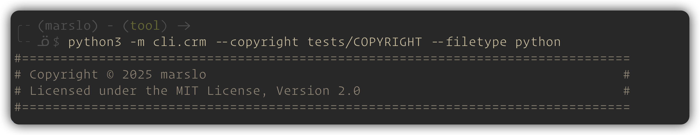
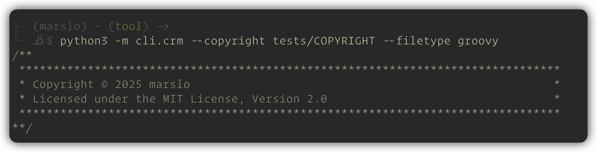

[](https://results.pre-commit.ci/latest/github/marslo/cr-manager/main)

---

# cr-manager -- the Copyright Header Manager

A tool to automatically **add**, **update**, or **delete** multi-format copyright headers in source files.

---

- [Features](#features)
- [Action Modes](#action-modes)
- [Supported File Types and Formats](#supported-file-types-and-formats)
- [running in pre-commit hooks](#running-in-pre-commit-hooks)
  - [prepare `.pre-commit-config.yaml`](#prepare-pre-commit-configyaml)
  - [install the pre-commit hooks](#install-the-pre-commit-hooks)
  - [run the cr-manager for all files](#run-the-cr-manager-for-all-files)
  - [automatic check in pre-commit hooks](#automatic-check-in-pre-commit-hooks)
  - [update the un-supported filetype](#update-the-un-supported-filetype)
- [run as a CLI tool](#run-as-a-cli-tool)
  - [poetry init and activate](#poetry-init-and-activate)
    - [install poetry](#install-poetry)
    - [init poetry environment](#init-poetry-environment)
    - [run as CLI](#run-as-cli)
    - [build as local package](#build-as-local-package)
  - [example usage](#example-usage)
    - [add new copyright headers](#add-new-copyright-headers)
    - [update existing copyright headers](#update-existing-copyright-headers)
    - [delete existing copyright headers](#delete-existing-copyright-headers)
    - [debug mode](#debug-mode)
- [help message](#help-message)

---

# Features

- **Add**: Insert copyright headers for multiple file types.
- **Update**: Force update or insert headers if missing.
- **Check**: Verify the presence and correctness of headers.
- **Delete**: Remove detected copyright headers from files.
- Supports recursive directory traversal and filetype auto-detection or override.
- Supports combined author-info and copyright headers.

---

# Action Modes

> [!TIP]
> without any action mode specified, the default action is to **add** copyright headers.

| OPTION     | DESCRIPTION                                                                 |
| ---------- | --------------------------------------------------------------------------- |
|            | Add mode: Automatically adds copyright headers to files.                    |
| `--check`  | Check mode: Verifies file copyright status (match, mismatch, or not found). |
| `--delete` | Delete mode: Removes detected copyright headers from files.                 |
| `--update` | Update mode: Forces replacement of copyright or adds it if missing.         |

---

# Supported File Types and Formats

> [!TIP]
> - check [Run as a CLI tool](#run-as-a-cli-tool) first to install necessary dependencies via `poetry install`.

|                    FILETYPE                   |           SUFFIXES          |
|:---------------------------------------------:|:---------------------------:|
| `python`, `shell`, `bash`, `sh`, `dockerfile` | `.py`, `.sh`, `.dockerfile` |

```
# without venv
$ poetry run cr-manager --filetype python

# with venv
$ cr-manager --filetype python
```

result
```
#===============================================================================
# Copyright © 2025 marslo                                                      #
# Licensed under the MIT License, Version 2.0                                  #
#===============================================================================
```



---

|                  FILETYPE                 |      SUFFIXES      |
|:-----------------------------------------:|:------------------:|
| `jenkinsfile`, `groovy`, `gradle`, `java` | `.groovy`, `.java` |

```
# without venv
$ poetry run cr-manager --filetype java

# with venv
$ cr-manager --filetype groovy
```

result
```
/**
 *******************************************************************************
 * Copyright © 2025 marslo                                                     *
 * Licensed under the MIT License, Version 2.0                                 *
 *******************************************************************************
**/
```



---

|                   FILETYPE                  |                  SUFFIXES                  |
|:-------------------------------------------:|:------------------------------------------:|
| `c`, `cpp`, `c++`, `cxx`, `h`, `hpp`, `hxx` | `.c`, `.cpp`, `.cxx`, `.h`, `.hpp`, `.hxx` |

```
# without venv
$ poetry run cr-manager --filetype c

# with venv
$ cr-manager --filetype cpp
```

result
```
/**
 * Copyright © 2025 marslo
 * Licensed under the MIT License, Version 2.0
 */
```


---

# running in pre-commit hooks

## prepare `.pre-commit-config.yaml`
```yaml
# if `COPYRIGHT` file can be found in the root directory of this repository
---
repos:
  - repo: https://github.com/marslo/cr-manager
    rev: v2.0.0
    hooks:
      - id: cr-manager
        args: ["--update"]

# or specify the copyright file to use
---
repos:
  - repo: https://github.com/marslo/cr-manager
    rev: v2.0.0
    hooks:
      - id: cr-manager
        args: ["--update", "--copyright", "/path/to/COPYRIGHT"]
```

```yaml
# only check the copyright headers without modifying files after commit
---
repos:
  - repo: https://github.com/marslo/cr-manager
    rev: v2.0.0
    hooks:
      - id: cr-manager
        args: ["--check"]
        stages: [post-commit]
```

## install the pre-commit hooks
```bash
$ pre-commit install
```

## run the cr-manager for all files

> [!TIP]
> without hook, you can run the cr-manager manually for all files in the repository.

```bash
$ pre-commit run cr-manager --all-files
```


## automatic check in pre-commit hooks
```bash
$ git commit -m "your commit message"
```

---

## update the un-supported filetype
```bash
$ python -m cli.crm [--update] --filetype python /path/to/file.txt
```


# run as a CLI tool

## poetry init and activate

### install poetry

| ENVIRONMENT | COMMAND                                                                                       |
|-------------|-----------------------------------------------------------------------------------------------|
| linux       | `curl -sSL https://install.python-poetry.org \| python3 -`                                    |
| windows     | `(Invoke-WebRequest -Uri https://install.python-poetry.org -UseBasicParsing).Content \| py -` |
| pip         | `pip install poetry`                                                                          |
| pipx        | `pipx install poetry`                                                                         |
| macOS       | `brew install poetry`                                                                         |

### init poetry environment

> [!NOTE]
> it will:
>> 1. create a virtual environment in the current directory
>> 2. install the `cr-manager` package and its dependencies

```bash
$ poetry install

# to cleanup the poetry venv
$ poetry env remove python
# - or -
$ poetry env remove --all
```

### run as CLI

- run in the poetry environment

  ```bash
  $ poetry run python -m cli.crm --help
  ```

- run in the virtual environment

  > [!TIP]
  > - to show/check the current venv:
  >> ```bash
  >> $ echo "${VIRTUAL_ENV}"
  >> /Users/marslo/Library/Caches/pypoetry/virtualenvs/cr-manager-Uc1EBq6P-py3.13
  >> ```
  > - to show the package in current venv
  >> ```bash
  >> $ which -a cr-manager
  >> ~/Library/Caches/pypoetry/virtualenvs/cr-manager-Uc1EBq6P-py3.13/bin/cr-manager
  >> ```

  ```bash
  # to activate the virtual environment
  $ source "$(poetry env info --path)/bin/activate"

  # run as cli
  $ python -m cli.crm --help

  # run as package
  $ cr-manager --help
  ```

### build as local package

```bash
# - in global --
$ python3 -m pip install --upgrade --editable .
# - in local --
$ python3 -m pip install --upgrade --user --editable .

$ cr-manager --help
```

## example usage

### add new copyright headers
```bash
# single file
$ python -m cli.crm /path/to/file

# files recursively in directories
$ python -m cli.crm --recursive /path/to/directory

# add to non-supported suffixes with supplied filetype
# -- e.e. add to .txt files as python files --
$ python -m cli.crm --filetype python /path/to/file.txt
```

### update existing copyright headers

> [!TIP]
> `--filetype <TYPE>` can be used to force a specific filetype for the update action, overriding auto-detection.

```bash
# single file
$ python -m cli.crm --update /path/to/file

# files recursively in directories
$ python -m cli.crm --update --recursive /path/to/directory
```

### delete existing copyright headers

> [!TIP]
> `--filetype <TYPE>` can be used to force a specific filetype for the update action, overriding auto-detection.

```bash
# single file
$ python -m cli.crm --delete /path/to/file

# files recursively in directories
$ python -m cli.crm --delete --recursive /path/to/directory
```

### debug mode
```bash
# *add* without modifying files
$ python -m cli.crm --debug /path/to/file

$ *update* without modifying files
$ python -m cli.crm --update --debug /path/to/file

# *delete* without modifying files
$ python -m cli.crm --delete --debug /path/to/file
```

# help message

```bash
$ poetry run python3 -m cli.crm --help
USAGE
  python3 -m cli.crm [--check | --delete | --update] [--copyright FILE] [--filetype TYPE]
                     [-r|--recursive] [--debug] [--verbose] [-h|--help] [-v|--version]
                     FILES ...

A tool to automatically add, update, or delete multi-format copyright headers.

POSITIONAL ARGUMENTS:
  FILES ...                 List of target files or directories to process.

ACTION MODES (default is add):
  -c, --check               Check mode: Verifies file copyright status (match, mismatch, or not found).
  -d, --delete              Delete mode: Removes detected copyright headers from files.
  -u, --update              Update mode: Forces replacement of copyright or adds it if missing.

OPTIONS:
  --copyright FILE          Specify the copyright template file path (default: COPYRIGHT).
  -t, --filetype TYPE       Force override a filetype instead of auto-detection.
                            If provided, displays a formatted preview for that type. Supported: bash, c,
                            c++, cpp, cxx, dockerfile, gradle, groovy, h, hpp, hxx, java, jenkinsfile,
                            python, sh, shell
  -r, --recursive           If FILES includes directories, process their contents recursively.
  --debug                   Debug mode: Preview the result of an action without modifying files.
  --verbose                 Show a detailed processing summary.
  -h, --help                Show this help message and exit.
  -v, --version             Show program's version number and exit.
```
